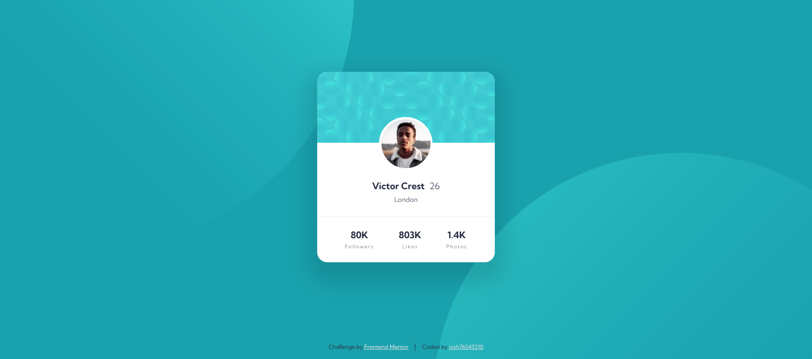

# Frontend Mentor - Profile card component solution

This is a solution to the [Profile card component challenge on Frontend Mentor](https://www.frontendmentor.io/challenges/profile-card-component-cfArpWshJ). Frontend Mentor challenges help you improve your coding skills by building realistic projects.

## Table of contents

- [Overview](#overview)
  - [The challenge](#the-challenge)
  - [Screenshot](#screenshot)
  - [Links](#links)
- [My process](#my-process)
  - [Built with](#built-with)
  - [What I learned](#what-i-learned)
- [Author](#author)

## Overview

### The challenge

- Build out the project to the designs provided

### Screenshot



### Links

- Solution URL: [Add solution URL here]()
- Live Site URL: [Add live site URL here]()

## My process

### Built with

- HTML
- CSS

### What I learned

- Create and position a layered background image

```css
body {
  font-family: "Kumbh Sans", sans-serif;
  line-height: 1;
  font-weight: 400;
  color: var(--very-dark-desaturated-blue);
  background-color: var(--dark-cyan);
  background-image: url(images/bg-pattern-top.svg),
    url(images/bg-pattern-bottom.svg);
  background-position: top -50rem left -28rem, bottom -57rem right -23rem;
  background-repeat: no-repeat;
}
```

## Author

- Frontend Mentor - [@josh76543210](https://www.frontendmentor.io/profile/josh76543210)
- Twitter - [@josh76543210](https://www.twitter.com/josh76543210)
